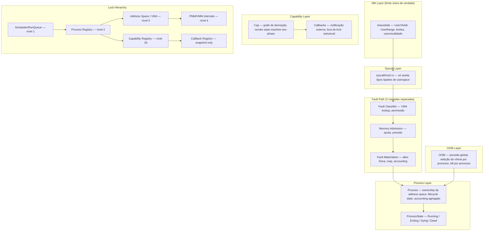
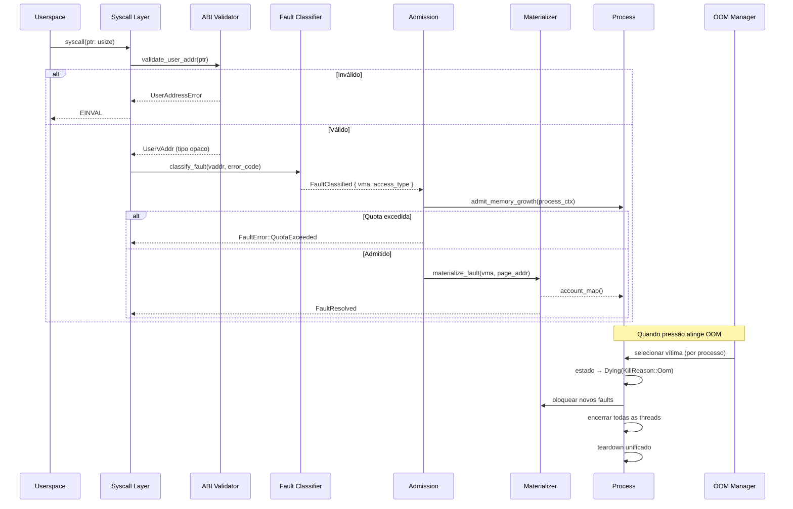

# Design Document: Kernel Robustness Improvements — Migração Arquitetural Dirigida por Invariantes

## Overview

Este documento cobre duas camadas de trabalho complementares:

**Camada 1 — Melhorias Incrementais (Fases 1–6, parcialmente implementadas):** Validação de memória, hardening de capabilities, OOM graceful degradation, cleanup de threads, resource limits e observabilidade. As fases 1–3 estão completas; as fases 4–6 estão em progresso.

**Camada 2 — Migração Arquitetural (Fases 0–9):** Plano de migração completo dirigido por invariantes que resolve o problema central: o kernel não está falhando por um único bug de MM, mas por fronteiras mal definidas entre MM, processo, OOM e capability lifecycle. A correção de nível produção exige eleger uma única fonte de verdade por conceito, eliminar semântica híbrida e transformar caminhos críticos em contratos explícitos e tipados.

## Invariantes Arquiteturais (Objetivo Final)

Ao fim da migração, o kernel deve obedecer estas regras sem exceção:

1. **Validação de userspace VA** tem uma única definição, vinda do ABI (`shared/abi`)
2. **Page fault resolution** só faz mecanismo de materialização, não policy de quota/OOM
3. **OOM opera por processo**, não por thread
4. **Capability revoke é transacional**: ou a árvore é revogada com resultado explícito, ou a falha sobe de forma estruturada
5. **Callbacks nunca executam sob lock estrutural**
6. **Locks seguem ordem documentada e auditável**, sem consultas cruzadas implícitas
7. **Falhas operacionais nunca usam assert!/panic! em caminho normal**
8. **Motivos de falha são tipados**, não comprimidos em bool

## Architecture



## Main Algorithm/Workflow



## Components and Interfaces

### Component 1: ABI — Fonte Única de Verdade para Endereços de Userspace

**Purpose**: Eliminar a duplicidade entre `validate_user_space_bounds()` (baseada em `KERNEL_BASE` local) e o contrato formal do ABI. O ABI passa a ser a única autoridade.

**Interface**:
```rust
// Em shared/abi/src/lib.rs — já existem parcialmente, expandir:
pub enum UserAddressError {
    NonCanonical,
    BelowUserMin,
    AboveUserMax,
    Overflow,
    EmptyRange,
}

pub fn validate_user_addr(addr: usize) -> Result<UserVAddr, UserAddressError>;
pub fn validate_user_range(base: usize, len: usize) -> Result<UserRange, UserAddressError>;
pub fn validate_user_return_addr(addr: usize) -> Result<UserVAddr, UserAddressError>;
```

**Tipos opacos**:
```rust
#[repr(transparent)]
pub struct UserVAddr(usize);  // endereço validado, não pode ser construído sem validação

#[derive(Clone, Copy)]
pub struct UserRange { pub base: UserVAddr, pub len: usize }
```

**Responsibilities**:
- Ser a única fonte de `is_valid_user_address`, `is_valid_user_range`, canonicalidade baixa
- Syscall layer só trabalha com `UserVAddr`/`UserRange`, nunca `usize` cru para ponteiro de userspace
- MM não aceita `usize` cru para ponteiro de userspace sem validação prévia via ABI

### Component 2: Fault Path — 3 Camadas Separadas

**Purpose**: Separar mecanismo de materialização de policy de quota/OOM. Atualmente `resolve_anon_fault()` mistura VMA lookup, accounting, policy de quota e OOM heurística no mesmo hot path.

**Interface**:
```rust
// Camada 1 — Classifier
pub fn classify_fault(
    pml4_phys: usize,
    fault_addr: usize,
    error_code: u64,
) -> Result<FaultClassified, FaultError>;

pub struct FaultClassified {
    pub vma: Vma,
    pub page_addr: usize,
    pub access_type: FaultAccessType,
}

// Camada 2 — Admission
pub fn admit_memory_growth(
    ctx: &ProcessMemoryContext,
    pages_needed: usize,
) -> Result<(), FaultError>;

pub struct ProcessMemoryContext {
    pub process_id: ProcessId,
    pub resident_pages: usize,
    pub limit_pages: usize,
}

// Camada 3 — Materializer
pub fn materialize_fault(
    pml4_phys: usize,
    vma: &Vma,
    page_addr: usize,
) -> Result<FaultResolved, FaultError>;

// Resultado tipado — substitui bool
pub type FaultResult = Result<FaultResolved, FaultError>;

pub struct FaultResolved;

pub enum FaultError {
    NoVma,
    AccessViolation,
    WriteToReadonly,
    ExecViolation,
    AddressNotUser,
    QuotaExceeded,
    PhysicalAllocFailed,
    MapFailed,
    ProcessContextMissing,
    InvariantBroken(&'static str),
}
```

**Responsibilities**:
- `classify_fault`: decide se endereço pertence a VMA e se acesso é permitido
- `admit_memory_growth`: decide se processo pode crescer (quota local, pressão global)
- `materialize_fault`: faz alloc física, zero-fill, map, accounting final — sem lookup global de processo

### Component 3: Process Lifecycle State Machine

**Purpose**: Modelar estados de processo explicitamente para que OOM e fault path possam tomar decisões corretas sem heurísticas.

**Interface**:
```rust
pub enum ProcessState {
    Running,
    Exiting(ExitReason),
    Dying(KillReason),
    Dead,
}

pub enum KillReason {
    Oom,
    FatalFault,
    CapabilityViolation,
}

pub enum ExitReason {
    Normal(i32),
    Signal(u32),
}

// Transições
pub fn transition_to_dying(process_id: ProcessId, reason: KillReason) -> Result<(), ProcessError>;
pub fn is_process_dying(process_id: ProcessId) -> bool;
pub fn get_process_state(process_id: ProcessId) -> Option<ProcessState>;
```

**Responsibilities**:
- Impedir novo fault materialization para processo em estado `Dying`
- Permitir que OOM marque processo como `Dying(KillReason::Oom)` antes de encerrar threads
- Garantir teardown determinístico: todas as threads → address space → recursos

### Component 4: OOM — Modelo 100% por Processo

**Purpose**: Corrigir o modelo atual que mata thread individual em OOM. OOM deve operar por processo.

**Interface**:
```rust
pub fn oom_kill_process() -> OomResult;

// Snapshot leve para OOM sem lock recursion
pub fn get_process_memory_snapshot() -> Vec<ProcessMemorySnapshot>;

pub struct ProcessMemorySnapshot {
    pub process_id: ProcessId,
    pub resident_pages: usize,
    pub limit_pages: usize,
    pub state: ProcessState,
}

// count_processes_over_limit: snapshot + análise, nunca análise sob registry lock
pub fn count_processes_over_limit_snapshot() -> usize;
```

**Responsibilities**:
- Selecionar vítima por processo (não por thread)
- Marcar processo como `Dying(KillReason::Oom)`
- Impedir novos faults/materializações para processo moribundo
- Encerrar todas as threads do processo
- Liberar address space e recursos por teardown unificado
- `count_processes_over_limit` nunca segura registry lock durante consultas profundas

### Component 5: Capability Revocation — Two-Phase com Resultado Explícito

**Purpose**: Eliminar revogação parcial silenciosa. `let _ = self.revoke(...)` deve desaparecer.

**Interface**:
```rust
pub enum RevokeError {
    ChildRevokeFailed(CapHandle),
    Busy(CapHandle),
    InvariantBroken(&'static str),
}

pub struct RevokeReport {
    pub revoked: Vec<CapHandle>,
    pub failed: Vec<(CapHandle, RevokeError)>,
}

// Two-phase revoke
pub fn revoke_capability_two_phase(
    handle: CapHandle,
    revoker: ThreadId,
) -> Result<RevokeReport, RevokeError>;

// Estado intermediário
pub enum CapState {
    Active,
    Revoking,  // fase 1: marcado, uso novo bloqueado
    Revoked,
}
```

**Responsibilities**:
- Fase 1: marcar subárvore como `Revoking`, impedir uso novo
- Fase 2: revogar filhos, commit final de remoção
- Propagar falhas de descendentes explicitamente em `RevokeReport`
- Estado final da árvore é observável e consistente

### Component 6: Callback Isolation

**Purpose**: Garantir que nenhum callback execute sob `REVOCATION_CALLBACKS` lock.

**Interface**:
```rust
// Padrão correto de invocação
fn invoke_revocation_callbacks_isolated(resource_type: ResourceType, handle: CapHandle) {
    // 1. Adquirir lock, clonar callbacks relevantes, liberar lock
    let callbacks: Vec<RevocationCallback> = {
        let registry = REVOCATION_CALLBACKS.lock();
        registry.get(&resource_type).cloned().unwrap_or_default()
    };
    // 2. Invocar sem lock global
    for cb in callbacks {
        cb(handle);
    }
}
```

**Responsibilities**:
- Snapshot de callbacks antes da invocação
- Executar callbacks fora do lock global
- Documentação alinhada ao comportamento real: panic em callback é bug fatal do kernel
- Sem promessa falsa de recuperação de panic em ambiente no_std

### Component 7: Lock Hierarchy

**Purpose**: Formalizar ordem de aquisição de locks para eliminar deadlocks acidentais.

**Hierarquia formal**:
```
Nível 1: Scheduler/RunQueue
Nível 2: Process Registry
  Nível 3: Process (individual)
    Nível 4: Address Space / VMA
      Nível 5: PMM/VMM map internals
Nível 2b: Capability Registry
  Nível 3b: Capability Object
Nível 6: Callback Registry (snapshot only — nunca segura durante invocação)
```

**Regras**:
- Quem segura lock de nível N não chama função que possa reentrar em lock de nível ≤ N
- Callbacks e hooks executam fora da árvore estrutural de locks
- Varreduras globais fazem snapshot, não travam o mundo
- `count_processes_over_limit` é snapshot + análise, nunca análise sob registry lock

### Component 8: Operational Error Handling

**Purpose**: Remover `assert!/panic!` de caminhos operacionais normais.

**Divisão em duas classes**:
```rust
// Classe A — Invariante fatal real: continua em panic
// Exemplos: corrupção de tabela central, impossibilidade de continuar com segurança
debug_assert!(invariant_holds, "kernel invariant broken: ...");

// Classe B — Falha operacional contida: vira erro estruturado
pub enum SyscallContextError {
    ProcessContextMismatch,
    InvalidUserReturnAddress,
    MissingAddressSpace,
    ThreadMetadataDrift,
}

// Substituir log_panic! operacional por:
return Err(SyscallContextError::InvalidUserReturnAddress);
// + teardown local do processo, não colapso sistêmico
```

## Data Models

### Model 1: ValidationError (existente, manter)

```rust
#[derive(Debug, Clone, Copy, PartialEq, Eq)]
pub enum ValidationError {
    Unaligned { addr: usize, required_alignment: usize },
    OutOfBounds { addr: usize, min: usize, max: usize },
    ProtectedResource { resource_id: u64 },
    NotInitialized,
    InvalidSize { size: usize, max_size: usize },
}
```

### Model 2: FaultError (novo — substitui bool)

```rust
#[derive(Debug, Clone, Copy, PartialEq, Eq)]
pub enum FaultError {
    NoVma,
    AccessViolation,
    WriteToReadonly,
    ExecViolation,
    AddressNotUser,
    QuotaExceeded,
    PhysicalAllocFailed,
    MapFailed,
    ProcessContextMissing,
    InvariantBroken(&'static str),
}
```

**Validation Rules**:
- Nenhum path de resolve retorna `bool`
- Logs incluem motivo tipado
- Caller não faz heurística textual para decidir ação

### Model 3: ProcessState (novo)

```rust
#[derive(Debug, Clone, Copy, PartialEq, Eq)]
pub enum ProcessState {
    Running,
    Exiting(ExitReason),
    Dying(KillReason),
    Dead,
}

#[derive(Debug, Clone, Copy, PartialEq, Eq)]
pub enum KillReason { Oom, FatalFault, CapabilityViolation }

#[derive(Debug, Clone, Copy, PartialEq, Eq)]
pub enum ExitReason { Normal(i32), Signal(u32) }
```

### Model 4: RevokeReport (novo)

```rust
#[derive(Debug)]
pub struct RevokeReport {
    pub revoked: Vec<CapHandle>,
    pub failed: Vec<(CapHandle, RevokeError)>,
}

#[derive(Debug, Clone, Copy)]
pub enum RevokeError {
    ChildRevokeFailed(CapHandle),
    Busy(CapHandle),
    InvariantBroken(&'static str),
}
```

**Validation Rules**:
- `let _ = self.revoke(...)` proibido — resultado sempre inspecionado
- Revogação parcial sempre surfaceada explicitamente

### Model 5: OomResult (existente, expandir)

```rust
pub enum OomResult {
    Killed { process_id: ProcessId, name: &'static str, pages_freed: usize },
    NoVictim { reason: NoVictimReason, fallback_action: FallbackAction },
    Reclaimed { strategy: ReclaimStrategy, pages_freed: usize },
}
```

### Model 6: CleanupResult (existente, manter)

```rust
pub struct CleanupResult {
    pub capabilities_revoked: usize,
    pub address_spaces_destroyed: usize,
    pub ipc_ports_closed: usize,
    pub physical_pages_freed: usize,
    pub leaks_detected: Vec<LeakedResource>,
    pub errors: Vec<CleanupError>,
}
```

### Model 7: ResourceLimits (existente, manter)

```rust
pub struct ResourceLimits {
    pub memory_pages: Limit,
    pub threads: Limit,
    pub capabilities: Limit,
    pub ipc_ports: Limit,
    pub address_spaces: Limit,
}
```

## Algorithmic Pseudocode

### Algoritmo: Page Fault Handler (pós-migração)

```pascal
ALGORITHM page_fault_handler(pml4_phys, fault_addr, error_code)
INPUT: pml4_phys, fault_addr, error_code
OUTPUT: FaultResult

BEGIN
  // Camada 1: Classifier — só mecanismo, sem policy
  classified ← classify_fault(pml4_phys, fault_addr, error_code)
  
  IF classified IS Error(e) THEN
    RETURN Error(e)  // NoVma, AccessViolation, etc.
  END IF
  
  // Verificar se processo está em estado terminal
  process_id ← process_id_for_pml4(pml4_phys)
  IF is_process_dying(process_id) THEN
    RETURN Error(FaultError::ProcessContextMissing)
  END IF
  
  // Camada 2: Admission — policy de quota, sem alloc física
  ctx ← get_process_memory_context(process_id)
  admission ← admit_memory_growth(ctx, pages_needed: 1)
  
  IF admission IS Error(e) THEN
    RETURN Error(e)  // QuotaExceeded
  END IF
  
  // Camada 3: Materializer — alloc física, map, accounting
  // Não consulta quota/OOM, não faz lookup global de processo
  RETURN materialize_fault(pml4_phys, classified.vma, classified.page_addr)
END
```

**Preconditions**:
- `classify_fault` não consulta quota nem OOM
- `materialize_fault` recebe contexto explícito, não faz lookup global

**Postconditions**:
- Resultado é tipado (FaultError), nunca bool
- Cada camada tem responsabilidade única

### Algoritmo: OOM Kill por Processo

```pascal
ALGORITHM oom_kill_process()
INPUT: none
OUTPUT: OomResult

BEGIN
  // Snapshot sem lock recursion
  snapshots ← get_process_memory_snapshot()
  
  best_victim ← None
  
  FOR each snap IN snapshots DO
    IF snap.state IS NOT Running THEN CONTINUE END IF
    IF snap.process_id IS kernel_process THEN CONTINUE END IF
    
    MATCH best_victim WITH
      | None → best_victim ← Some(snap)
      | Some(prev) →
          IF snap.resident_pages > prev.resident_pages THEN
            best_victim ← Some(snap)
          END IF
    END MATCH
  END FOR
  
  MATCH best_victim WITH
    | None → RETURN OomResult::NoVictim { ... }
    | Some(victim) →
        // 1. Marcar processo como Dying — impede novos faults
        transition_to_dying(victim.process_id, KillReason::Oom)
        
        // 2. Encerrar todas as threads do processo
        FOR each thread IN get_process_threads(victim.process_id) DO
          terminate_thread(thread, TerminationReason::ProcessKilled)
        END FOR
        
        // 3. Teardown unificado (address space, capabilities, IPC)
        cleanup_process_resources(victim.process_id)
        
        RETURN OomResult::Killed {
          process_id: victim.process_id,
          pages_freed: victim.resident_pages
        }
  END MATCH
END
```

### Algoritmo: Capability Two-Phase Revoke

```pascal
ALGORITHM revoke_capability_two_phase(handle, revoker)
INPUT: handle, revoker
OUTPUT: Result<RevokeReport, RevokeError>

BEGIN
  report ← RevokeReport::new()
  
  // Fase 1: Marcar como Revoking, impedir uso novo
  MATCH mark_cap_revoking(handle) WITH
    | Error(e) → RETURN Error(e)
    | Ok(children) →
        // Fase 1 recursiva nos filhos
        FOR each child IN children DO
          MATCH mark_cap_revoking(child) WITH
            | Error(e) → report.failed.push((child, e))
            | Ok(_) → // continua
          END MATCH
        END FOR
  END MATCH
  
  // Fase 2: Commit — remover da árvore
  FOR each cap_to_remove IN [handle] + children_marked DO
    MATCH commit_revoke(cap_to_remove, revoker) WITH
      | Ok(()) → report.revoked.push(cap_to_remove)
      | Error(e) → report.failed.push((cap_to_remove, e))
    END MATCH
  END FOR
  
  // Invocar callbacks FORA do lock
  invoke_revocation_callbacks_isolated(resource_type, handle)
  
  RETURN Ok(report)
END
```

### Algoritmo: Callback Isolation

```pascal
ALGORITHM invoke_revocation_callbacks_isolated(resource_type, handle)
INPUT: resource_type, handle
OUTPUT: none (side effects)

BEGIN
  // Passo 1: Snapshot sob lock — liberar imediatamente
  callbacks ← []
  
  SEQUENCE
    lock REVOCATION_CALLBACKS
    IF resource_type IN REVOCATION_CALLBACKS THEN
      callbacks ← clone(REVOCATION_CALLBACKS[resource_type])
    END IF
    unlock REVOCATION_CALLBACKS
  END SEQUENCE
  
  // Passo 2: Invocar sem lock global
  FOR each cb IN callbacks DO
    // Panic em callback = bug fatal do kernel (documentado)
    cb(handle)
  END FOR
END
```

## Error Handling

### Error Scenario 1: Fault em Processo Dying

**Condition**: Page fault chega para processo já marcado como `Dying`
**Response**: Retornar `FaultError::ProcessContextMissing` imediatamente
**Recovery**: Thread recebe sinal de terminação, não tenta materializar
**Logging**: Log com process_id e estado atual

### Error Scenario 2: Revogação Parcial de Capability

**Condition**: Filho de capability falha ao ser revogado
**Response**: `RevokeReport` com `failed` populado, revogação dos demais continua
**Recovery**: Estado da árvore é observável; caller decide ação
**Logging**: Log cada falha com CapHandle e RevokeError

### Error Scenario 3: Callback Panic

**Condition**: Callback de revogação entra em panic
**Response**: Em no_std, panic propaga — é bug fatal do kernel
**Recovery**: Não há recuperação; callback deve ser escrito para não panicking
**Logging**: Documentação explícita: "panic em callback é bug fatal"

### Error Scenario 4: OOM sem Vítima

**Condition**: Sistema OOM mas nenhum processo userspace elegível
**Response**: `OomResult::NoVictim` com fallback action
**Recovery**: `DenyAllocation` ou `EnterEmergencyMode`
**Logging**: Snapshot completo de memória por processo

### Error Scenario 5: Erro Operacional em Syscall Path

**Condition**: Contexto de processo ausente, return address inválido, PML4 mismatch
**Response**: `SyscallContextError` estruturado → teardown local do processo
**Recovery**: Processo entra em `Dying(KillReason::FatalFault)`, kernel continua
**Logging**: Log com tid, syscall_num, motivo tipado

## Testing Strategy

### Unit Testing Approach

1. **ABI Address Validation**: testar `validate_user_addr` com endereços válidos, nulos, kernel-space, não-canônicos, overflow
2. **Fault Path Separation**: testar cada camada (classify/admit/materialize) isoladamente com mocks
3. **ProcessState Machine**: testar transições válidas e inválidas
4. **Two-Phase Revoke**: testar revogação completa, parcial, com filhos falhando
5. **Callback Isolation**: verificar que callbacks não executam sob lock

### Property-Based Testing Approach

**Property Test Library**: QuickCheck (Rust)

**Properties**:
1. `validate_user_addr(addr).is_ok()` ↔ `addr ∈ [USER_SPACE_MIN, USER_SPACE_MAX)`
2. Para todo fault resolvido: `FaultResult` é `Ok` ou `Err(FaultError::*)` — nunca bool
3. Após OOM kill: processo está em estado `Dead` ou `Dying`, nunca `Running`
4. `RevokeReport.revoked ∪ RevokeReport.failed` = conjunto completo de handles na subárvore
5. Nenhum callback é invocado enquanto `REVOCATION_CALLBACKS` está locked

### Integration Testing Approach

1. **Fault Path End-to-End**: syscall → ABI validation → classify → admit → materialize
2. **OOM Flow**: pressão → snapshot → seleção por processo → Dying → teardown
3. **Capability Lifecycle**: create → derive → two-phase revoke → RevokeReport
4. **Lock Order**: verificar que nenhuma sequência de operações viola a hierarquia

## Performance Considerations

- ABI validation: operações bitwise, ~5 ciclos por chamada
- Fault path split: overhead mínimo — 3 funções em vez de 1, sem alocações extras
- ProcessState: campo adicional em `Process` struct, acesso O(1)
- OOM snapshot: cópia de Vec<ProcessMemorySnapshot>, O(n) em número de processos — aceitável pois OOM é raro
- Two-phase revoke: overhead de marcação adicional, compensado pela correção semântica
- Callback isolation: clone de Vec de ponteiros de função, O(k) onde k = número de callbacks registrados

## Security Considerations

1. **Fonte única de verdade para VA**: elimina divergência entre ABI e kernel MM que poderia ser explorada para bypass de validação
2. **Fault path sem policy**: materializer não pode ser usado para inferir informações de quota de outros processos
3. **OOM por processo**: elimina possibilidade de matar thread de processo privilegiado enquanto processo sobrevive em estado zumbi
4. **Revogação explícita**: elimina capability parcialmente revogada que poderia ser reutilizada
5. **Callbacks fora de lock**: elimina deadlock induzido por callback malicioso que tenta adquirir o mesmo lock

## Dependencies

- `shared/abi` — fonte de `UserVAddr`, `UserRange`, `UserAddressError`, limites de VA
- `kernel/src/mm/vma.rs` — VMA lookup, materialização
- `kernel/src/mm/pmm.rs` — alocação física
- `kernel/src/process.rs` — lifecycle state, accounting agregado
- `kernel/src/mm/oom.rs` — pressão global, seleção de vítima
- `kernel/src/cap.rs` — grafo de derivação, revoke state machine
- `kernel/src/thread.rs` — cleanup coordinator
