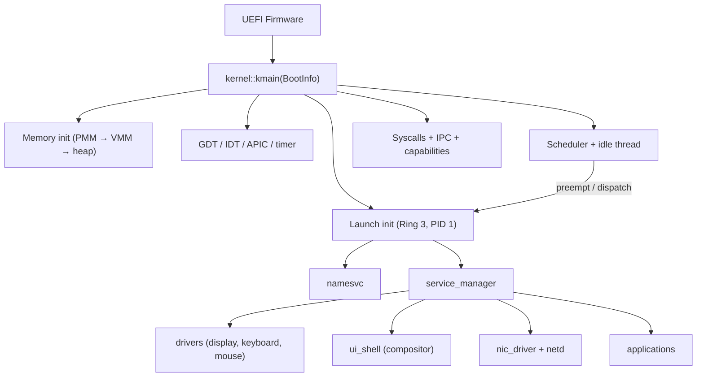
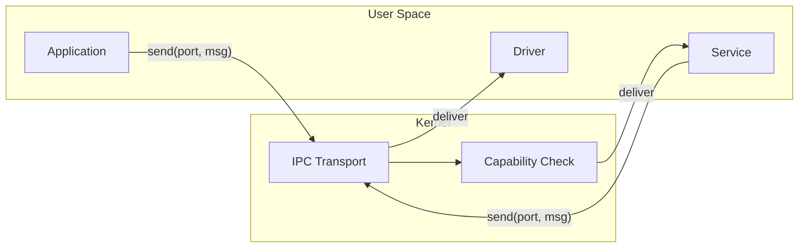

# Sistema Operacional Atom
[Read in English](README.md)


**Atom** é um **sistema operacional microkernel baseado em capacidades** experimental (desenvolvido majoritariamente por vibe coding), escrito em **Rust** e **assembly x86-64**, com uma pilha completa em espaço de usuário incluindo uma biblioteca C independente, renderização OpenGL por software, um ambiente de desktop com janelas e suporte a aplicações nativas.

> ⚠️ **Software experimental.** Espere mudanças que quebram compatibilidade, funcionalidades faltando e comportamentos inesperados. O projeto existe principalmente para aprendizado, pesquisa e validação incremental de ideias de design de SO.

---

## O que é o Atom

Atom é um SO microkernel onde o kernel fornece a base de computação confiável mínima — gerenciamento de memória, escalonamento, transporte IPC e aplicação de capacidades — enquanto todos os componentes com lógica mais complexa (drivers, sistema de arquivos, interface gráfica, aplicações) rodam no **espaço de usuário** como serviços isolados que se comunicam via **troca de mensagens**.

**Princípios de design:**

- **Segurança orientada a capacidades** — autoridade explícita, privilégio mínimo, delegação e revogação transitiva. Todo objeto do kernel é acessado por meio de handles de capacidade, não por autoridade ambiente.
- **Isolamento forte** — espaços de endereçamento separados com tabelas de páginas por processo, mapeamento do kernel na metade superior e operações de memória validadas.
- **IPC como espinha dorsal da composição** — portas e mensagens com suporte a cópia zero via regiões de memória compartilhada, detecção de deadlock, herança de prioridade e operações em lote.
- **Espaço de usuário orientado a serviços** — init, gerenciador de serviços e serviço de nomes formam um barramento de serviços que descobre e gerencia todos os componentes do sistema em tempo de execução.
- **Escalonamento preemptivo com SMP** — filas de execução por CPU com round-robin por prioridade, preempção por timer local, wakeups entre núcleos e IPIs de reagendamento.

---

## Estado Atual

**Build de referência mais recente: alpha_5**

### Kernel

- Boot UEFI em x86-64 via QEMU/OVMF
- Gerenciador de memória física com bootstrap em duas fases (bitmap estático na inicialização, bitmap dinâmico a partir da RAM) suportando até 16 GiB
- Gerenciador de memória virtual com paginação de 4 níveis, tabelas de páginas com cópia profunda e verificação, rastreamento de VMAs com páginas de guarda e infraestrutura de paginação por demanda
- Alocador de heap do kernel (alocações pequenas baseadas em slab + fallback por página)
- Interrupções via IDT + APIC local com preempção por timer e IPI de reagendamento entre núcleos
- Boot SMP via ACPI MADT (descoberta de BSP/AP, trampolim de startup de AP, rastreamento de núcleos online por CPU)
- Troca de contexto em assembly x86-64 com trampolim na metade superior, validação de canário de pilha, verificações de endereço canônico e estado de pilha de syscall por CPU (swapgs)
- Escalonador por CPU (idle/current/ready queue por núcleo) com work stealing, wakeups remotos e máscaras de afinidade
- ~116 syscalls cobrindo threads, IPC, capacidades, memória compartilhada, sistema de arquivos, modos de vídeo, criação de processos e infraestrutura de dispositivos PCI/MMIO/DMA/IRQ
- Subsistema IPC com portas, mensagens, detecção de ciclos de deadlock, herança de prioridade, filas de espera e envio/recebimento em lote
- Sistema de capacidades com acesso baseado em handles, flags de permissão em bits, derivação, revogação transitiva e log de auditoria
- Gerenciador de memória compartilhada com alocação dinâmica de janelas de VA e limpeza na saída do dono
- Drivers no kernel: AHCI (SATA), FAT32, Bochs Graphics Adapter (troca de resolução em runtime), enumeração PCI e entrada xHCI/USB-HID
- Stack FAT32 com suporte a leitura/escrita via syscalls POSIX roteadas pelo fsd, com caminho de dados em disco ativo sob o driver FAT32 em userspace no fsd via I/O de bloco bruto
- Criação de processos a partir do sistema de arquivos via `SYS_SPAWN_FROM_PATH`, carregando **executáveis ATXF v3 assinados** (Ed25519, verificados contra uma raiz de confiança no kernel antes do mapeamento) em espaços de endereçamento isolados
- Superfície de syscalls PCI/MMIO/DMA/IRQ para que drivers em espaço de usuário (ex.: o NIC e1000) reivindiquem BARs, mapeiem memória de dispositivo, aloquem buffers DMA e recebam interrupções

### Espaço de Usuário

- **Serviços:** init (PID 1), namesvc (descoberta de serviços), service_manager (boot declarativo), fsd (daemon de sistema de arquivos), app_launcher (criação privilegiada de processos), nic_driver (NIC e1000), netd (stack TCP/IP: ARP, IPv4, ICMP, UDP, TCP, DNS)
- **Aplicações de sistema:** driver de display, driver de teclado, driver de mouse, ui_shell (compositor + gerenciador de janelas), emulador de terminal, configurações de display
- **Aplicações:** gerenciador de arquivos (com lançamento por duplo clique de executáveis .atxf), demo TinyGL gears, hello_c (demo do runtime C), hello_atxf, suite de testes do sistema de arquivos, browser, timesync (HTTP GET, demonstra a stack de rede completa) e security_smoke (harness de auto-teste adversarial de CI)

### Runtime e Bibliotecas

- **libc** — biblioteca C padrão independente (string, stdlib, stdio, ctype, errno, assert, math via FPU x87, unistd, time) com inicialização de runtime em crt0.S, malloc/free via SYS_MMAP/SYS_MUNMAP e formatação completa com vsnprintf
- **TinyGL** — renderização OpenGL 1.1 por software (port do TinyGL 0.4.1) como biblioteca estática independente com uma ponte de blit customizada convertendo RGB565 para superfícies ARGB32 do compositor
- **libgui** — biblioteca Rust para criação de janelas, primitivas de desenho (retângulos arredondados, mistura alpha, sombras suaves) e tratamento de eventos via IPC
- **atom_ui / atom_theme** — camadas de widgets e temas de mais alto nível construídas sobre a libgui
- **libimage** — decodificadores de imagem em Rust (PNG/GIF/JPEG) para assets de apps e do desktop
- **libnet** — biblioteca cliente de rede em Rust (sockets, HTTP, ICMP, helpers de DNS) para apps que falam com o `netd`
- **libipc** — wrapper IPC em Rust para serviços no espaço de usuário
- **libring** — primitiva de ring buffer lock-free compartilhada entre serviços
- **atom_abi** — crate compartilhada que define números de syscall, constantes e tipos como fonte única de verdade entre o kernel e o espaço de usuário

### Ambiente de Desktop

- Compositor com janelamento por superfícies compartilhadas, gerenciamento de ordem Z e encerramento gracioso de janelas (estado PendingClose)
- Dock em formato de pílula, controles de janela circulares, títulos de janela centralizados e pontos indicadores da aplicação ativa

---

## Visão Geral da Arquitetura

### Kernel vs Espaço de Usuário

```
┌──────────────────────────────────────────────────────────────┐
│                   Espaço de Usuário (Ring 3)                   │
│                                                                │
│  Serviços          Apps de Sistema       Aplicações           │
│  ├ init            ├ driver de display   ├ gerenc. arquivos   │
│  ├ namesvc         ├ driver de teclado   ├ terminal*          │
│  ├ service_manager ├ driver de mouse     ├ tinygl_demo        │
│  ├ fsd             ├ ui_shell            ├ browser            │
│  ├ app_launcher    │   (compositor)      ├ timesync           │
│  ├ nic_driver      └ display_settings    └ hello_c / hello_atxf│
│  └ netd                                                       │
│                       (* terminal roda como app de sistema)   │
│                                                                │
│  Bibliotecas: libc, tinygl, libgui, atom_ui, atom_theme,      │
│               libimage, libnet, libipc, libring, atom_abi     │
├──────────────────────────────────────────────────────────────┤
│              Interface de Syscall (~116 chamadas)              │
├──────────────────────────────────────────────────────────────┤
│                       Kernel (Ring 0)                          │
│                                                                │
│  PMM/VMM    Escalonador  IPC + MemComp   Capacidades           │
│  Heap       Threads      Desp. Syscall   FAT32 / AHCI          │
│  Paginação  Interrupções Troca contexto  PCI / xHCI / BGA      │
└──────────────────────────────────────────────────────────────┘
```

### Fluxo de Boot



### IPC e Composição de Serviços

Todos os componentes do espaço de usuário se comunicam por portas IPC do kernel. O gerenciador de serviços inicia os serviços declarados na configuração de boot, e o serviço de nomes permite descoberta em tempo de execução. As capacidades controlam quais serviços cada processo pode acessar.



---

## Estrutura do Repositório

```text
atom/
├── kernel/
│   └── src/
│       ├── kernel.rs              # Ponto de entrada do kernel e ligação de módulos
│       ├── arch/                  # GDT e glue específico de arquitetura
│       ├── mm/                    # PMM, VMM, heap, espaços de endereç., OOM, VMA
│       ├── interrupts/            # IDT, APIC, handlers, assembly de troca de contexto
│       ├── drivers/              # Drivers no kernel (AHCI, FAT32, BGA, PCI, xHCI/USB-HID)
│       ├── syscall/             # Despacho de syscalls (mod.rs) + tabela de política de capabilities
│       ├── cap/ , cap.rs          # Sistema de capacidades
│       ├── ipc.rs                 # Portas IPC, mensagens, detecção de deadlock
│       ├── sched.rs , smp.rs      # Escalonador preemptivo por prioridade + bringup SMP
│       ├── thread.rs , process.rs # Primitivas de thread e processo
│       ├── shared_mem.rs          # Regiões de memória compartilhada
│       ├── executable.rs          # Carregamento ATXF / mapeamento de imagem
│       ├── system_manifest.rs     # Manifesto de capabilities por serviço (raiz de confiança)
│       ├── *_selftests.rs         # Auto-testes arquiteturais e de segurança no boot
│       └── init_process.rs        # Lança init (PID 1) em espaço de endereçamento isolado
├── shared/
│   ├── abi/                       # atom_abi: tipos/constantes compartilhados (kernel ↔ userspace)
│   └── atxf/                      # atom_atxf: formato ATXF v3 + loader assinado
├── userspace/
│   ├── libs/                      # libc, tinygl, libgui, atom_ui, atom_theme, libimage,
│   │                              #   libnet, libipc, libring, wrappers de syscall
│   ├── system_apps/               # drivers de display, teclado, mouse; ui_shell; terminal;
│   │                              #   display_settings; demo_rects / demo_text
│   ├── services/                  # init, namesvc, service_manager, fsd, app_launcher,
│   │                              #   nic_driver, netd
│   └── apps/                      # fileman, tinygl_demo, hello_c, hello_atxf, fs_test,
│                                  #   browser, timesync, security_smoke
├── tools/
│   └── elf2atxf/                  # Conversor ELF → ATXF assinado para executáveis do userspace
├── keys/                          # Chaves de assinatura ATXF / material da raiz de confiança
├── scripts/ci/                    # Gates de segurança e build (ver docs/security_pipeline.md)
├── linker/                        # Scripts de linker para o target UEFI
├── build.sh / build.ps1           # Scripts de build, empacotamento e execução
└── clean.sh / clean.ps1           # Scripts de limpeza
```

---

## Compilando e Executando

O Atom roda no **QEMU** com firmware **OVMF** (UEFI). Os scripts de build cuidam da configuração do toolchain, compilação de todos os membros do workspace, conversão para ATXF, empacotamento da imagem de disco e execução do QEMU.

### Requisitos

- Rust nightly (fixado pelo `rust-toolchain.toml`) com o componente `rust-src`
- QEMU x86-64
- Firmware OVMF
- Compilador cruzado C (para builds da libc e TinyGL)

### Compilar e Executar

**Linux / macOS:**

```bash
./build.sh --clean --run           # núcleo único
./build.sh --run --smp=2           # SMP dois núcleos
./build.sh --run --smp=4           # SMP quatro núcleos
```

**Windows (PowerShell):**

```powershell
.\build.ps1 --clean --run
.\build.ps1 --run --Smp 4
```

### Depuração

A saída serial pelo console do QEMU é o canal de depuração principal. O kernel inclui logging estruturado com tags por subsistema. A saída debugcon do QEMU pode ser redirecionada para `debugcon.txt` dependendo da configuração dos scripts.

---

## Limitações Conhecidas

Atom é um sistema experimental em desenvolvimento ativo. As limitações conhecidas atualmente incluem:

- **SMP validado apenas no QEMU x86-64** — o hardening para hardware real (variações mais amplas de APIC/ACPI) ainda está em andamento
- **Rede exige o netdev `user` do QEMU** — o driver e1000 e a stack TCP/IP (`netd`) usam a rede user-mode embutida do QEMU (`-netdev user,id=net0 -device e1000,netdev=net0`). Ambos os scripts de build adicionam essas flags automaticamente com `--run`. Hardware real ou outros backends de netdev do QEMU ainda não são suportados.
- **Integração de replay de journal para FAT32 em userspace ainda está amadurecendo** — o caminho normal de leitura/escrita já é de propriedade do fsd, mas a cobertura de recuperação pós-crash ainda está em expansão
- **Aplicação de capacidades é parcial** — a infraestrutura de capacidades (handles, permissões, derivação, revogação) está implementada, mas nem todas as syscalls verificam capacidades antes da execução
- **Sem ASLR ou detecção de estouro de pilha** no espaço de usuário
- **Apenas QEMU** — não testado em hardware real

---

## Roadmap

Veja o arquivo **`ROADMAP.md`** para o plano detalhado por fases. As prioridades de curto prazo incluem:

- Isolamento de descritores de arquivo por processo
- Aplicação completa de capacidades em todas as syscalls
- Validação de ponteiros de usuário nas syscalls legadas
- Consolidação da abstração de processos (processo como dono canônico; thread como cache/espelho)
- Hardening de SMP para caminhos de hardware fora do QEMU e telemetria mais profunda do escalonador

Os objetivos de longo prazo incluem suporte a ARM64, cobertura mais profunda de rede e expansão de drivers.

---

## Contribuindo

Contribuições são bem-vindas, especialmente em:

- **Hardening de segurança** — aplicação de capacidades, validação de ponteiros de usuário, sandboxing de syscalls
- **Documentação** — protocolo IPC, modelo de capacidades, referência de syscalls, layout de memória, formato ATXF
- **Testes** — testes de fumaça automatizados no QEMU, pipelines de CI, fuzzing de syscalls
- **Evolução do espaço de usuário** — novos serviços, drivers e aplicações
- **Ferramentas de depuração e rastreamento**

Veja [`CONTRIBUTING.md`](CONTRIBUTING.md) e [`docs/security_pipeline.md`](docs/security_pipeline.md).

---

## Pipeline de segurança

O Atom OS inclui um pipeline de segurança obrigatório (forçado no CI, **sem**
`continue-on-error`). Uma forma documentada de rodar cada parte:

```bash
make ci-build       # compila cada crate crítica + imagem bootável
make ci-security    # fmt, clippy, gate de política de syscall, gate de TODO de
                    # segurança, baseline de unsafe, cargo audit, cargo deny, semgrep
make ci-qemu        # smoke adversarial no QEMU (SMP 1/2/4); falha a menos que o
                    # log serial mostre `SECURITY_SMOKE PASS all`
```

O pipeline quebra o build em: uma nova syscall sem classificação explícita de
política, um aumento injustificado de `unsafe`, um `TODO` de segurança não
rastreado, uma violação de advisory/licença/origem de supply-chain, ou qualquer
cenário adversarial do QEMU (PR1–PR5) que não passe. Referência completa em
[`docs/security_pipeline.md`](docs/security_pipeline.md),
[`SECURITY.md`](SECURITY.md) e [`SECURITY_DEBT.md`](SECURITY_DEBT.md).

---

## Licença

Veja o arquivo `LICENSE` para mais detalhes.
