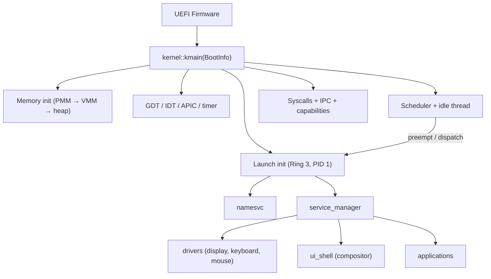
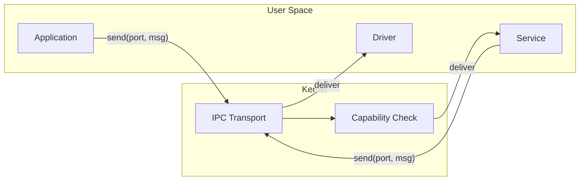

# Sistema Operacional Atom
[Read in English](README.md)


**Atom** é um **sistema operacional microkernel baseado em capacidades** experimental (desenvolvido majoritariamente por vibe coding), escrito em **Rust** e **assembly x86-64**, com uma pilha completa em espaço de usuário incluindo uma biblioteca C independente, renderização OpenGL por software, um ambiente de desktop com janelas e suporte a aplicações nativas.

> ⚠️ **Software experimental.** Espere mudanças que quebram compatibilidade, funcionalidades faltando e comportamentos inesperados. O projeto existe principalmente para aprendizado, pesquisa e validação incremental de ideias de design de SO.

---

## O que é o Atom

Atom é um SO microkernel onde o kernel fornece a base de computação confiável mínima — gerenciamento de memória, escalonamento, transporte IPC e aplicação de capacidades — enquanto todos os componentes com lógica mais complexa (drivers, sistema de arquivos, interface gráfica, aplicações) rodam no **espaço de usuário** como serviços isolados que se comunicam via **troca de mensagens**.

**Princípios de design:**

- **Segurança orientada a capacidades** — autoridade explícita, privilégio mínimo, delegação e revogação transitiva. Todo objeto do kernel é acessado por meio de handles de capacidade, não por autoridade ambiente.
- **Isolamento forte** — espaços de endereçamento separados com tabelas de páginas por processo, mapeamento do kernel na metade superior e operações de memória validadas.
- **IPC como espinha dorsal da composição** — portas e mensagens com suporte a cópia zero via regiões de memória compartilhada, detecção de deadlock, herança de prioridade e operações em lote.
- **Espaço de usuário orientado a serviços** — init, gerenciador de serviços e serviço de nomes formam um barramento de serviços que descobre e gerencia todos os componentes do sistema em tempo de execução.
- **Escalonamento preemptivo** — escalonador baseado em prioridade com round-robin dentro dos níveis e preempção dirigida por timer.

---

## Estado Atual

**Última versão: alpha_4** (março de 2026)

### Kernel

- Boot UEFI em x86-64 via QEMU/OVMF
- Gerenciador de memória física com bootstrap em duas fases (bitmap estático na inicialização, bitmap dinâmico a partir da RAM) suportando até 16 GiB
- Gerenciador de memória virtual com paginação de 4 níveis, tabelas de páginas com cópia profunda e verificação, rastreamento de VMAs com páginas de guarda e infraestrutura de paginação por demanda
- Alocador de heap do kernel (alocações pequenas baseadas em slab + fallback por página)
- Interrupções via IDT + APIC local com preempção por timer
- Troca de contexto em assembly x86-64 com trampolim na metade superior, validação de canário de pilha e verificações de endereço canônico
- ~80 syscalls cobrindo threads, IPC, capacidades, memória compartilhada, sistema de arquivos, modos de vídeo e criação de processos
- Subsistema IPC com portas, mensagens, detecção de ciclos de deadlock, herança de prioridade, filas de espera e envio/recebimento em lote
- Sistema de capacidades com acesso baseado em handles, flags de permissão em bits, derivação, revogação transitiva e log de auditoria
- Gerenciador de memória compartilhada com alocação dinâmica de janelas de VA e limpeza na saída do dono
- Driver do Bochs Graphics Adapter para troca de resolução de tela em tempo de execução
- Stack FAT32 com suporte a leitura/escrita via syscalls POSIX roteadas pelo fsd, com caminho de dados em disco ativo sob FAT32 em userspace no fsd via I/O de bloco bruto
- Criação de processos a partir do sistema de arquivos via `SYS_SPAWN_FROM_PATH`, carregando executáveis ATXF em espaços de endereçamento isolados

### Espaço de Usuário

- **Serviços:** init (PID 1), namesvc (descoberta de serviços), service_manager (boot declarativo), fsd (daemon de sistema de arquivos), app_launcher (criação privilegiada de processos)
- **Aplicações de sistema:** driver de display, driver de teclado, driver de mouse, ui_shell (compositor + gerenciador de janelas), emulador de terminal
- **Aplicações:** gerenciador de arquivos (com lançamento por duplo clique de executáveis .atxf), demo TinyGL gears, hello_c (demo do runtime C), suite de testes do sistema de arquivos, configurações de display

### Runtime e Bibliotecas

- **libc** — biblioteca C padrão independente (string, stdlib, stdio, ctype, errno, assert, math via FPU x87, unistd, time) com inicialização de runtime em crt0.S, malloc/free via SYS_MMAP/SYS_MUNMAP e formatação completa com vsnprintf
- **TinyGL** — renderização OpenGL 1.1 por software (port do TinyGL 0.4.1) como biblioteca estática independente com uma ponte de blit customizada convertendo RGB565 para superfícies ARGB32 do compositor
- **libgui** — biblioteca Rust para criação de janelas, primitivas de desenho (retângulos arredondados, mistura alpha, sombras suaves) e tratamento de eventos via IPC
- **libipc** — wrapper IPC em Rust para serviços no espaço de usuário
- **atom_abi** — crate compartilhada que define números de syscall, constantes e tipos como fonte única de verdade entre o kernel e o espaço de usuário

### Ambiente de Desktop

- Compositor com janelamento por superfícies compartilhadas, gerenciamento de ordem Z e encerramento gracioso de janelas (estado PendingClose)
- Dock em formato de pílula, controles de janela circulares, títulos de janela centralizados e pontos indicadores da aplicação ativa

---

## Visão Geral da Arquitetura

### Kernel vs Espaço de Usuário

```
┌─────────────────────────────────────────────────────────┐
│                 Espaço de Usuário (Ring 3)               │
│                                                         │
│  Serviços          Apps de Sistema      Aplicações      │
│  ├ init            ├ driver de display  ├ gerenc. arqs  │
│  ├ namesvc         ├ driver teclado     ├ terminal       │
│  ├ service_manager ├ driver de mouse    ├ tinygl_demo   │
│  ├ fsd             └ ui_shell           └ hello_c       │
│  └ app_launcher      (compositor)                       │
│                                                         │
│  Bibliotecas: libc, libtinygl, libgui, libipc, atom_abi │
├─────────────────────────────────────────────────────────┤
│              Interface de Syscall (~80 chamadas)         │
├─────────────────────────────────────────────────────────┤
│                      Kernel (Ring 0)                     │
│                                                         │
│  PMM/VMM    Escalonador  IPC + MemComp  Capacidades      │
│  Heap       Threads      Desp. Syscall  Driver FAT32     │
│  Paginação  Interrupções Troca contexto Modos de vídeo   │
└─────────────────────────────────────────────────────────┘
```

### Fluxo de Boot



### IPC e Composição de Serviços

Todos os componentes do espaço de usuário se comunicam por portas IPC do kernel. O gerenciador de serviços inicia os serviços declarados na configuração de boot, e o serviço de nomes permite descoberta em tempo de execução. As capacidades controlam quais serviços cada processo pode acessar.



---

## Estrutura do Repositório

```text
atom/
├── kernel/
│   └── src/
│       ├── kernel.rs              # Ponto de entrada do kernel e ligação de módulos
│       ├── mm/                    # PMM, VMM, heap, espaços de endereç., mem. compartilhada
│       ├── interrupts/            # IDT, APIC, handlers, assembly de troca de contexto
│       ├── drivers/               # Drivers no kernel (AHCI, FAT32, vídeo BGA)
│       ├── ipc.rs                 # Portas IPC, mensagens, detecção de deadlock
│       ├── cap.rs                 # Sistema de capacidades
│       ├── sched.rs               # Escalonador preemptivo por prioridade
│       ├── thread.rs              # Primitivas de thread e processo
│       └── init_process.rs        # Lança init (PID 1) em espaço de endereçamento isolado
├── shared/                        # atom_abi: tipos e constantes compartilhados (kernel ↔ userspace)
├── userspace/
│   ├── libs/                      # libipc, libgui, wrappers de syscall, libc, libtinygl
│   ├── system_apps/               # Drivers de display, teclado, mouse; ui_shell; terminal
│   ├── services/                  # init, namesvc, service_manager, fsd, app_launcher
│   └── apps/                      # fileman, doom, tinygl_demo, hello_c, fs_test, display_settings
├── tools/
│   └── elf2atxf/                  # Conversor de binários ELF → ATXF para executáveis do userspace
├── linker/                        # Scripts de linker para target UEFI
├── build.sh / build.ps1           # Scripts de build, empacotamento e execução
└── clean.sh / clean.ps1           # Scripts de limpeza
```

---

## Compilando e Executando

O Atom roda no **QEMU** com firmware **OVMF** (UEFI). Os scripts de build cuidam da configuração do toolchain, compilação de todos os membros do workspace, conversão para ATXF, empacotamento da imagem de disco e execução do QEMU.

### Requisitos

- Rust nightly (fixado pelo `rust-toolchain.toml`) com o componente `rust-src`
- QEMU x86-64
- Firmware OVMF
- Compilador cruzado C (para builds da libc e TinyGL)

### Compilar e Executar

**Linux / macOS:**

```bash
./build.sh --clean --run
```

**Windows (PowerShell):**

```powershell
.\build.ps1 --clean --run
```

### Depuração

A saída serial pelo console do QEMU é o canal de depuração principal. O kernel inclui logging estruturado com tags por subsistema. A saída debugcon do QEMU pode ser redirecionada para `debugcon.txt` dependendo da configuração dos scripts.

---

## Limitações Conhecidas

Atom é um sistema experimental em desenvolvimento ativo. As limitações conhecidas atualmente incluem:

- **Apenas um núcleo** — sem suporte a SMP ainda; o escalonador e o IPC foram projetados para execução em núcleo único
- **Sem rede** — sem driver de NIC ou pilha TCP/IP
- **Integração de replay de journal para FAT32 em userspace ainda está amadurecendo** — o caminho normal de leitura/escrita já é de propriedade do fsd, mas a cobertura de recuperação pós-crash ainda está em expansão
- **Aplicação de capacidades é parcial** — a infraestrutura de capacidades (handles, permissões, derivação, revogação) está implementada, mas nem todas as syscalls verificam capacidades antes da execução
- **Sem ASLR ou detecção de estouro de pilha** no espaço de usuário
- **Apenas QEMU** — não testado em hardware real

---

## Roadmap

Veja o arquivo **`ROADMAP.md`** para o plano detalhado por fases. As prioridades de curto prazo incluem:

- Isolamento de descritores de arquivo por processo
- Aplicação completa de capacidades em todas as syscalls
- Validação de ponteiros de usuário nas syscalls legadas
- Abstração de processos (consolidando propriedade de thread, espaço de endereçamento e recursos)
- Fundações para SMP (estruturas por CPU, bloqueio IPC atômico)

Os objetivos de longo prazo incluem rede, escalonamento SMP, suporte a ARM64 e cobertura expandida de drivers.

---

## Contribuindo

Contribuições são bem-vindas, especialmente em:

- **Hardening de segurança** — aplicação de capacidades, validação de ponteiros de usuário, sandboxing de syscalls
- **Documentação** — protocolo IPC, modelo de capacidades, referência de syscalls, layout de memória, formato ATXF
- **Testes** — testes de fumaça automatizados no QEMU, pipelines de CI, fuzzing de syscalls
- **Evolução do espaço de usuário** — novos serviços, drivers e aplicações
- **Ferramentas de depuração e rastreamento**

---

## Licença

Veja o arquivo `LICENSE` para mais detalhes.
