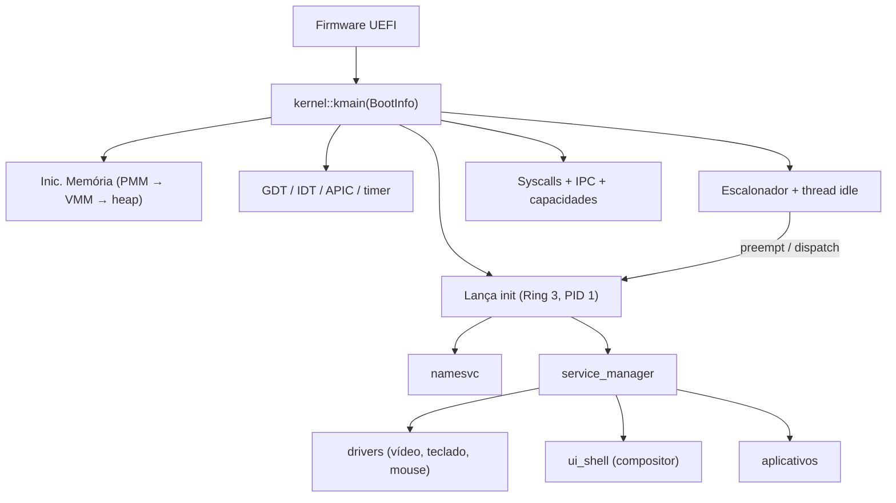

# Sistema Operacional Atom
[Read in English](README.md)


O **Atom** é um **sistema operacional de microkernel baseado em capacidades**, experimental (e desenvolvido majoritariamente no "vibe-coding"), escrito em **Rust** e **Assembly x86-64**. Ele conta com uma stack completa de espaço de usuário, incluindo uma biblioteca C independente (*freestanding*), renderização OpenGL via software, um ambiente de desktop em janelas e suporte a aplicativos nativos.

> ⚠️ **Software experimental.** Espere mudanças drásticas, recursos ausentes e instabilidades. O projeto é voltado principalmente para aprendizado, pesquisa e validação incremental de ideias de design de sistemas operacionais.

-----

## O que é o Atom

O Atom é um SO de microkernel onde o kernel fornece a base mínima de computação confiável — gerenciamento de memória, escalonamento, transporte IPC e imposição de capacidades — enquanto todos os componentes de política pesada (drivers, sistema de arquivos, UI, aplicativos) rodam no **espaço de usuário** como serviços isolados que se comunicam via **troca de mensagens**.

**Princípios de design:**

  * **Segurança baseada em capacidades** — autoridade explícita, privilégio mínimo, delegação e revogação transitiva. Cada objeto do kernel é acessado através de identificadores de capacidade (*handles*), e não por autoridade ambiente.
  * **Isolamento forte** — espaços de endereçamento separados com tabelas de páginas por processo, mapeamento de kernel na metade superior (*higher-half*) e operações de memória validadas.
  * **IPC como espinha dorsal** — portas e mensagens com suporte a *zero-copy* via regiões de memória compartilhada, detecção de deadlock, herança de prioridade e operações em lote.
  * **Espaço de usuário orientado a serviços** — o *init*, o gerenciador de serviços e o serviço de nomes formam um barramento que descobre e gerencia todos os componentes do sistema em tempo de execução.
  * **Escalonamento preemptivo** — escalonador baseado em prioridade com *round-robin* dentro dos níveis de prioridade e preempção baseada em temporizador.

-----

## Status Atual

**Último lançamento: alpha\_4** (Março de 2026)

### Kernel

  * Boot UEFI em x86-64 via QEMU/OVMF.
  * Gerenciador de memória física com bootstrap em duas fases (bitmap estático no boot, bitmap dinâmico da RAM) suportando até 16 GiB.
  * Gerenciador de memória virtual com paginação de 4 níveis, tabelas de páginas com cópia profunda (*deep-copy*) e verificação, rastreamento de VMA com páginas de guarda e infraestrutura de paginação sob demanda (*demand paging*).
  * Alocador de heap do kernel (pequenas alocações baseadas em *slabs* + fallback de página).
  * Interrupções via IDT + Local APIC com preempção por timer.
  * Troca de contexto em Assembly x86-64 com trampolim em *higher-half*, validação de *stack canary* e verificações de endereço canônico.
  * Cerca de 80 chamadas de sistema (*syscalls*) cobrindo threads, IPC, capacidades, memória compartilhada, sistema de arquivos, modos de vídeo e criação de processos.
  * Subsistema de IPC com portas, mensagens, detecção de ciclo de deadlock, herança de prioridade, filas de espera e envio/recebimento em lote.
  * Sistema de capacidades com acesso baseado em *handles*, sinalizadores de permissão, derivação, revogação transitiva e log de auditoria.
  * Gerenciador de memória compartilhada com alocação dinâmica de janela de endereço virtual e limpeza ao sair do proprietário.
  * Driver Bochs Graphics Adapter para troca de resolução de tela em tempo de execução.
  * Driver de sistema de arquivos FAT32 (somente leitura) com tabela de descritores de arquivos a nível de kernel.
  * Criação de processos a partir do sistema de arquivos via `SYS_SPAWN_FROM_PATH`, carregando executáveis ATXF em espaços de endereçamento isolados.

### Espaço de Usuário

  * **Serviços:** init (PID 1), namesvc (descoberta de serviços), service\_manager (boot declarativo), fsd (daemon de sistema de arquivos), app\_launcher (criação de processos privilegiados).
  * **Aplicativos de sistema:** driver de vídeo, driver de teclado, driver de mouse, ui\_shell (compositor + gerenciador de janelas), emulador de terminal.
  * **Aplicativos:** gerenciador de arquivos (com lançamento de executáveis .atxf via clique duplo), demo de engrenagens TinyGL, hello\_c (demo de runtime C), suíte de testes de sistema de arquivos, configurações de tela.

### Runtime e Bibliotecas

  * **libc** — biblioteca padrão C autônoma (string, stdlib, stdio, ctype, errno, assert, math via x87 FPU, unistd, time) com inicialização de runtime crt0.S, malloc/free via SYS\_MMAP/SYS\_MUNMAP e formatação vsnprintf completa.
  * **TinyGL** — renderização OpenGL 1.1 via software (port do TinyGL 0.4.1) como uma biblioteca estática independente com uma ponte de *blit* personalizada convertendo superfícies RGB565 para ARGB32 do compositor.
  * **libgui** — biblioteca Rust para criação de janelas, primitivas de desenho (retângulos arredondados, mistura alfa, sombras suaves) e manipulação de eventos via IPC.
  * **libipc** — wrapper IPC em Rust para serviços de espaço de usuário.
  * **atom\_abi** — crate compartilhada definindo números de syscall, constantes e tipos como fonte única de verdade entre kernel e espaço de usuário.

-----

## Visão Geral da Arquitetura

### Kernel vs Espaço de Usuário

```
┌─────────────────────────────────────────────────────────┐
│                 Espaço de Usuário (Ring 3)              │
│                                                         │
│  Serviços          Apps de Sistema      Aplicativos     │
│  ├ init            ├ driver de vídeo    ├ gerenc. arq.  │
│  ├ namesvc         ├ driver teclado     ├ terminal      │
│  ├ service_manager ├ driver mouse       ├ tinygl_demo   │
│  ├ fsd             └ ui_shell           └ hello_c       │
│  └ app_launcher      (compositor)                       │
│                                                         │
│  Bibliotecas: libc, libtinygl, libgui, libipc, atom_abi │
├─────────────────────────────────────────────────────────┤
│               Interface de Syscall (~80 chamadas)       │
├─────────────────────────────────────────────────────────┤
│                      Kernel (Ring 0)                    │
│                                                         │
│  PMM/VMM    Escalonador    IPC + MemCompart    Capacid. │
│  Heap       Threads        Dispatch Syscall    FAT32    │
│  Paginação  Interrupções   Troca de contexto   Vídeo    │
└─────────────────────────────────────────────────────────┘
```

### Fluxo de Boot



-----

## Estrutura do Repositório

```text
atom/
├── kernel/
│   └── src/
│       ├── kernel.rs          # Ponto de entrada do kernel e conexão de módulos
│       ├── mm/                # PMM, VMM, heap, espaços de end., mem. compartilhada
│       ├── interrupts/        # IDT, APIC, handlers, assembly de troca de contexto
│       ├── drivers/           # Drivers internos (AHCI, FAT32, vídeo BGA)
│       ├── ipc.rs             # Portas IPC, mensagens, detecção de deadlock
│       ├── cap.rs             # Sistema de capacidades
│       ├── sched.rs           # Escalonador de prioridade preemptivo
│       ├── thread.rs          # Primitivas de thread e processo
│       └── init_process.rs    # Lança o init (PID 1) em espaço isolado
├── shared/                    # atom_abi: tipos e constantes (kernel ↔ userspace)
├── userspace/
│   ├── libs/                  # libipc, libgui, wrappers de syscall, libc, libtinygl
│   ├── system_apps/           # drivers de vídeo, teclado, mouse; ui_shell; terminal
│   ├── services/              # init, namesvc, service_manager, fsd, app_launcher
│   └── apps/                  # fileman, doom, tinygl_demo, hello_c, fs_test
├── tools/
│   └── elf2atxf/              # Conversor ELF → ATXF para executáveis de usuário
├── linker/                    # Scripts de linker para o alvo UEFI
├── build.sh / build.ps1       # Scripts de build, empacotamento e execução
└── clean.sh / clean.ps1       # Scripts de limpeza
```

-----

## Compilando e Executando

O Atom roda sob o **QEMU** com **OVMF** (firmware UEFI). Os scripts de build cuidam da configuração do toolchain, compilação de todos os membros do workspace, conversão ATXF, empacotamento da imagem de disco e lançamento do QEMU.

### Requisitos

  * Rust nightly (fixado pelo `rust-toolchain.toml`) com o componente `rust-src`.
  * QEMU x86-64.
  * Firmware OVMF.
  * Cross-compilador C (para builds da libc e TinyGL).

### Compilar e Rodar

**Linux / macOS:**

```bash
./build.sh --clean --run
```

**Windows (PowerShell):**

```powershell
.\build.ps1 --clean --run
```

-----

## Limitações Conhecidas

O Atom é um sistema experimental em desenvolvimento ativo. As limitações atuais incluem:

  * **Apenas Single-core** — ainda sem suporte a SMP; o escalonador e o IPC foram projetados para execução em um único núcleo.
  * **Sem Rede** — sem driver de placa de rede ou pilha TCP/IP.
  * **FAT32 Somente Leitura** — o suporte ao sistema de arquivos limita-se a ler de uma imagem de disco FAT32.
  * **Imposição Parcial de Capacidades** — a infraestrutura (handles, permissões, revogação) está implementada, mas nem todas as syscalls verificam capacidades antes da execução.
  * **Sem ASLR ou detecção de estouro de pilha** no espaço de usuário.
  * **Apenas QEMU** — não testado em hardware real.

-----

## Contribuição

Contribuições são bem-vindas, especialmente em:

  * **Endurecimento de segurança** — imposição de capacidades, validação de ponteiros de usuário, sandboxing de syscalls.
  * **Documentação** — protocolo IPC, modelo de capacidades, referência de syscalls, layout de memória.
  * **Testes** — testes de fumaça automatizados no QEMU, pipelines de CI, fuzzing de syscalls.
  * **Evolução do espaço de usuário** — novos serviços, drivers e aplicativos.

-----

## Licença

Consulte o arquivo `LICENSE` para mais detalhes.
