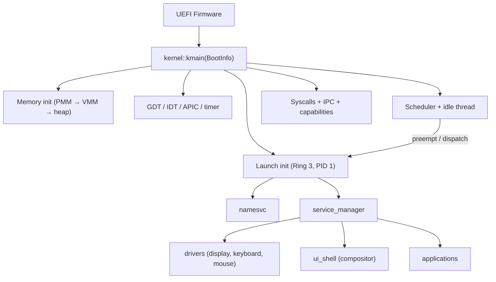
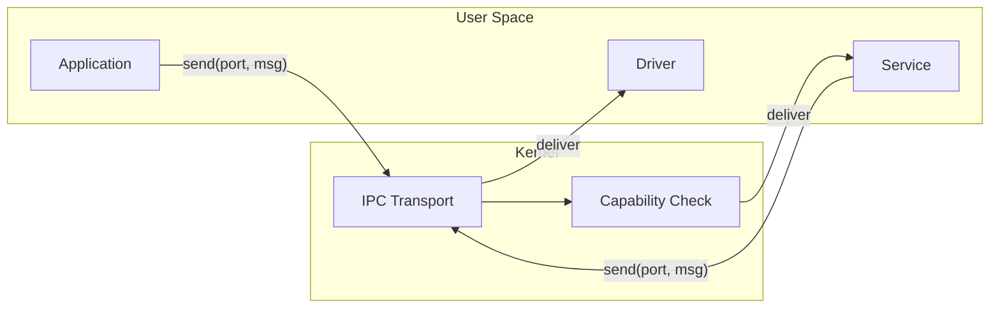

# Atom Operating System


**Atom** is an experimental **capability-based microkernel operating system** written in **Rust** and **x86-64 assembly**, with a complete user-space stack including a freestanding C library, software OpenGL rendering, a windowed desktop environment, and native application support.

> ⚠️ **Experimental software.** Expect breaking changes, missing features, and sharp edges. The project is primarily for learning, research, and incremental validation of OS design ideas.

---

## What Atom Is

Atom is a microkernel OS where the kernel provides the minimum trusted computing base — memory management, scheduling, IPC transport, and capability enforcement — while all policy-heavy components (drivers, filesystem, UI, applications) run in **user space** as isolated services communicating via **message passing**.

**Design principles:**

- **Capabilities-first security** — explicit authority, least privilege, delegation, and transitive revocation. Every kernel object is accessed through capability handles, not ambient authority.
- **Strong isolation** — separate address spaces with per-process page tables, higher-half kernel mapping, and validated memory operations.
- **IPC as the composition backbone** — ports and messages with support for zero-copy via shared memory regions, deadlock detection, priority inheritance, and batch operations.
- **Service-oriented user space** — init, service manager, and name service form a service bus that discovers and manages all system components at runtime.
- **Preemptive scheduling** — priority-based scheduler with round-robin within priority levels and timer-driven preemption.

---

## Current Status

**Latest release: alpha_4** (March 2026)

### Kernel

- UEFI boot on x86-64 via QEMU/OVMF
- Physical memory manager with two-phase bootstrap (static bitmap at boot, dynamic bitmap from RAM) supporting up to 16 GiB
- Virtual memory manager with 4-level paging, deep-copy page tables with verification pass, VMA tracking with guard pages, and demand paging infrastructure
- Kernel heap allocator (slab-based small allocations + page fallback)
- Interrupts via IDT + Local APIC with timer preemption
- Context switching in x86-64 assembly with higher-half trampoline, stack canary validation, and canonical address checks
- ~80 syscalls covering threads, IPC, capabilities, shared memory, filesystem, video modes, and process spawning
- IPC subsystem with ports, messages, deadlock cycle detection, priority inheritance, wait queues, and batch send/receive
- Capability system with handle-based access, permission bitflags, derivation, transitive revocation, and audit logging
- Shared memory manager with dynamic VA window allocation and owner-exit cleanup
- Bochs Graphics Adapter driver for runtime display resolution switching
- FAT32 filesystem driver (read-only) with kernel-level file descriptor table
- Process spawning from filesystem via `SYS_SPAWN_FROM_PATH` loading ATXF executables into isolated address spaces

### User Space

- **Services:** init (PID 1), namesvc (service discovery), service_manager (declarative boot), fsd (filesystem daemon), app_launcher (privileged process creation)
- **System applications:** display driver, keyboard driver, mouse driver, ui_shell (compositor + window manager), terminal emulator
- **Applications:** file manager (with double-click launching of .atxf executables), Doom port (640×400 via doomgeneric + TinyGL), TinyGL gears demo, hello_c (C runtime demo), filesystem test suite, display settings

### Runtime and Libraries

- **libc** — freestanding C standard library (string, stdlib, stdio, ctype, errno, assert, math via x87 FPU, unistd, time) with crt0.S runtime initialization, malloc/free via SYS_MMAP/SYS_MUNMAP, and full vsnprintf formatting
- **TinyGL** — software OpenGL 1.1 rendering (port of TinyGL 0.4.1) as a freestanding static library with a custom blit bridge converting RGB565 to compositor ARGB32 surfaces
- **libgui** — Rust library for window creation, drawing primitives (rounded rectangles, alpha blending, soft shadows), and event handling via IPC
- **libipc** — Rust IPC wrapper for user-space services
- **SVG rasterizer** — minimal no_std SVG renderer supporting rect, circle, ellipse, polygon, polyline, line, path (M/L/H/V/Z/C/S/Q/A), fill/stroke, group transforms, CSS class selectors, and named color parsing
- **atom_abi** — shared crate defining syscall numbers, constants, and types as a single source of truth between kernel and user space

### Desktop Environment

- Compositor with shared-surface windowing, Z-order management, and graceful window shutdown (PendingClose state)
- Pill-shaped dock, circular window controls, centered window titles, active application indicator dots
- SVG icons throughout the interface

---

## Architecture Overview

### Kernel vs User Space

```
┌─────────────────────────────────────────────────────────┐
│                    User Space (Ring 3)                   │
│                                                         │
│  Services          System Apps         Applications     │
│  ├ init            ├ display driver    ├ file manager   │
│  ├ namesvc         ├ keyboard driver   ├ doom           │
│  ├ service_manager ├ mouse driver      ├ terminal       │
│  ├ fsd             └ ui_shell          ├ tinygl_demo    │
│  └ app_launcher      (compositor)      └ hello_c        │
│                                                         │
│  Libraries: libc, libtinygl, libgui, libipc, atom_abi   │
├─────────────────────────────────────────────────────────┤
│                 Syscall Interface (~80 calls)            │
├─────────────────────────────────────────────────────────┤
│                     Kernel (Ring 0)                      │
│                                                         │
│  PMM/VMM    Scheduler    IPC + SharedMem    Capabilities │
│  Heap       Threads      Syscall dispatch   FAT32 driver │
│  Paging     Interrupts   Context switch     Video modes  │
└─────────────────────────────────────────────────────────┘
```

### Boot Flow



### IPC and Service Composition

All user-space components communicate through kernel IPC ports. The service manager starts services declared in the boot configuration, and the name service allows runtime discovery. Capabilities control which services each process can access.



---

## Repository Layout

```text
atom/
├── kernel/
│   └── src/
│       ├── kernel.rs              # Kernel entry point and module wiring
│       ├── mm/                    # PMM, VMM, heap, address spaces, shared memory
│       ├── interrupts/            # IDT, APIC, handlers, context switch assembly
│       ├── drivers/               # In-kernel drivers (AHCI, FAT32, BGA video)
│       ├── ipc.rs                 # IPC ports, messages, deadlock detection
│       ├── cap.rs                 # Capability system
│       ├── sched.rs               # Preemptive priority scheduler
│       ├── thread.rs              # Thread and process primitives
│       └── init_process.rs        # Launches init (PID 1) in isolated address space
├── shared/                        # atom_abi: shared types and constants (kernel ↔ userspace)
├── userspace/
│   ├── libs/                      # libipc, libgui, syscall wrappers, libc, libtinygl
│   ├── system_apps/               # display, keyboard, mouse drivers; ui_shell; terminal
│   ├── services/                  # init, namesvc, service_manager, fsd, app_launcher
│   └── apps/                      # fileman, doom, tinygl_demo, hello_c, fs_test, display_settings
├── tools/
│   └── elf2atxf/                  # ELF → ATXF binary converter for user-space executables
├── linker/                        # Linker scripts for UEFI target
├── build.sh / build.ps1           # Build, package, and run scripts
└── clean.sh / clean.ps1           # Cleanup scripts
```

---

## Building and Running

Atom runs under **QEMU** with **OVMF** (UEFI firmware). The build scripts handle toolchain setup, compilation of all workspace members, ATXF conversion, disk image packaging, and QEMU launch.

### Requirements

- Rust nightly (pinned by `rust-toolchain.toml`) with `rust-src` component
- QEMU x86-64
- OVMF firmware
- C cross-compiler (for libc and TinyGL builds)

### Build and Run

**Linux / macOS:**

```bash
./build.sh --clean --run
```

**Windows (PowerShell):**

```powershell
.\build.ps1 --clean --run
```

### Debugging

Serial output via QEMU console is the primary debugging channel. The kernel includes structured logging with per-subsystem tags. QEMU debugcon output can be routed to `debugcon.txt` depending on script configuration.

---

## Known Limitations

Atom is an experimental system in active development. Current known limitations include:

- **Single-core only** — no SMP support yet; scheduler and IPC are designed for single-core execution
- **No networking** — no NIC driver or TCP/IP stack
- **FAT32 read-only** — filesystem support is limited to reading from a FAT32 disk image
- **Capability enforcement is partial** — the capability infrastructure (handles, permissions, derivation, revocation) is implemented, but not all syscalls enforce capability checks before execution
- **No ASLR or stack overflow detection** in user space
- **QEMU only** — not tested on real hardware

---

## Roadmap

See **`ROADMAP.md`** for the detailed phased plan. Near-term priorities include:

- Per-process file descriptor isolation
- Full capability enforcement across all syscalls
- User pointer validation in legacy syscalls
- Process abstraction (consolidating thread/address-space/resource ownership)
- SMP foundations (per-CPU structures, atomic IPC blocking)

Longer-term goals include networking, SMP scheduling, ARM64 support, and expanded driver coverage.

---

## Contributing

Contributions are welcome, especially around:

- **Security hardening** — capability enforcement, user pointer validation, syscall sandboxing
- **Documentation** — IPC protocol, capability model, syscall reference, memory layout, ATXF format
- **Testing** — automated QEMU smoke tests, CI pipelines, syscall fuzzing
- **User-space evolution** — new services, drivers, and applications
- **Debugging and tracing tools**

---

## License

See the `LICENSE` file for details.
