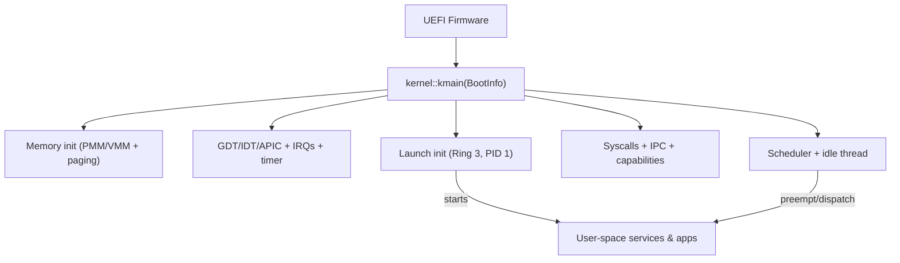
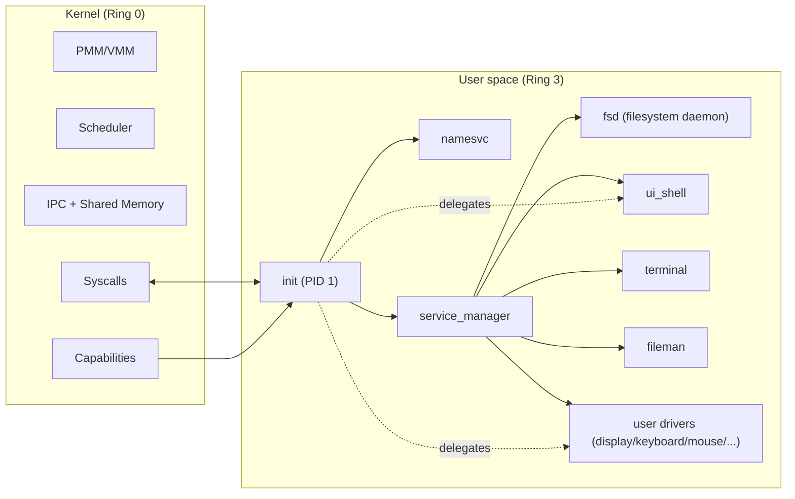

# Atom Operating System


**Atom** is an experimental **capability-based operating system** written in **Rust**, focused on learning OS architecture and exploring security through **capabilities**, **isolation**, and **message passing**.

> ⚠️ **Experimental software.** Expect breaking changes, missing features, and sharp edges. The project is primarily for learning, research, and incremental validation of OS design ideas.

---

## What Atom is

Atom’s goal is a small, auditable kernel that provides the *minimum trusted computing base*, while moving policy-heavy components to **user space**.

Key ideas:

* **Capabilities-first security**: explicit authority, least privilege, delegation (and revocation-oriented design)
* **Strong isolation**: separate address spaces (per-process page tables) and mapping validation
* **IPC as the default composition tool**: ports + messages, with support for **zero-copy** via shared memory
* **Preemptive scheduling**: priority scheduling with round-robin within priority levels
* **UEFI boot on x86_64**: designed for QEMU/OVMF and incremental evolution toward real hardware

---

## Current status (high level)

Atom already implements the backbone needed for a real OS “spine”:

* UEFI boot + boot info handoff
* Physical & virtual memory management (paging, address spaces)
* Kernel heap allocator (slab-based small allocs + page fallback)
* Interrupts + APIC/timer preemption
* Threads and priority-based preemptive scheduler
* Extensive syscall surface (≈50 syscalls)
* IPC subsystem (ports/messages) + shared memory support (zero-copy paths)
* Capability system used to control access to kernel objects and devices
* Working user space with `init` (PID 1), services, drivers, and apps (UI shell, terminal, file manager, fs tests)

---

## Architecture overview

### Boot and control flow

**UEFI → kernel bring-up → create `init` (PID 1, Ring 3) → scheduler runs the system**



### Kernel vs user space responsibilities

* **Kernel (Ring 0):** memory primitives, scheduler, syscalls, IPC transport, capability enforcement, low-level interrupts
* **User space (Ring 3):** services, user drivers, UI/apps, higher-level policy



---

## Repository layout

This repository is a Rust workspace containing the kernel, a shared ABI crate, build tooling, and a full user-space tree.

```text
fpedrolucas95-atom/
├── arch/                        # Top-level architecture support
├── kernel/                      
│   └── src/
│       ├── kernel.rs            # Kernel entry + module wiring
│       ├── mm/                  # PMM/VMM/heap/address spaces
│       ├── interrupts/          # IDT/APIC/handlers + asm context switch bits
│       ├── drivers/             # In-kernel drivers (AHCI/FAT32/USB/xHCI...)
│       ├── ipc.rs               # IPC ports/messages
│       ├── cap.rs               # Capability system
│       ├── sched.rs             # Preemptive scheduler
│       ├── thread.rs            # Thread/process primitives
│       └── init_process.rs      # Launches user-space init (PID 1)
├── linker/                      # Linker scripts (UEFI target)
├── shared/                      # Shared ABI/types used across kernel and user space
├── tools/                       # Build tools
│   └── elf2atxf/                # ELF → ATXF converter used for user-space payloads
├── userspace/                   # Ring-3 world (apps, drivers, libs, services)
│   ├── libs/                    # libipc, libgui, syscall wrapper crate, etc.
│   ├── drivers/                 # user drivers (display/keyboard/mouse/terminal/ui_shell...)
│   ├── services/                # init, namesvc, service_manager, fsd
│   └── apps/                    # fileman, fs_test, ...
├── build.sh / build.ps1         # Build + package + run scripts (QEMU/UEFI)
├── clean.sh / clean.ps1         # Cleanup scripts
```

---

## Building & running

Atom is typically run under **QEMU** using **OVMF** (UEFI firmware). The build scripts automate toolchain setup, compilation, packaging, and launching.

### Requirements

* Rust nightly (pinned by `rust-toolchain.toml`)
* `rust-src` component
* Targets commonly used in this workspace:

  * `x86_64-unknown-uefi` (kernel)
  * `x86_64-unknown-none` (tools such as `elf2atxf`)
* QEMU (x86_64)
* OVMF firmware for QEMU

### One-command build + run

#### Linux/macOS

```bash
./build.sh --clean --run
```

#### Windows (PowerShell)

```powershell
.\build.ps1 --clean --run
```

> Tip: If you are iterating on a specific component, check the scripts for flags such as building only the kernel or only user space.

### Debugging

* Serial output is usually the best early signal (QEMU console / debug console).
* The repo includes `debugcon.txt` (useful if you route QEMU debugcon output there, depending on your script config).

## Roadmap

See **`ROADMAP.md`** for the current phased plan. Typical upcoming themes include:

* Hardening process lifecycle and resource cleanup (including capability cleanup)
* Expanding memory policies (fault handling, demand paging, richer VMAs)
* Moving more drivers/services to user space
* SMP support (multi-core scheduling and per-CPU structures)
* Network support
* Real hardware support and other architectures (ARM64, RISCV)

---

## Contributing

Contributions are welcome, especially around:

* Documentation (IPC/capability model, syscalls, memory layout, ATXF format)
* Automated QEMU smoke tests / CI
* Capability auditing and security hardening
* User-space services and driver evolution
* Debugging/tracing tools
  
---

## License

See the `LICENSE` file for details.
