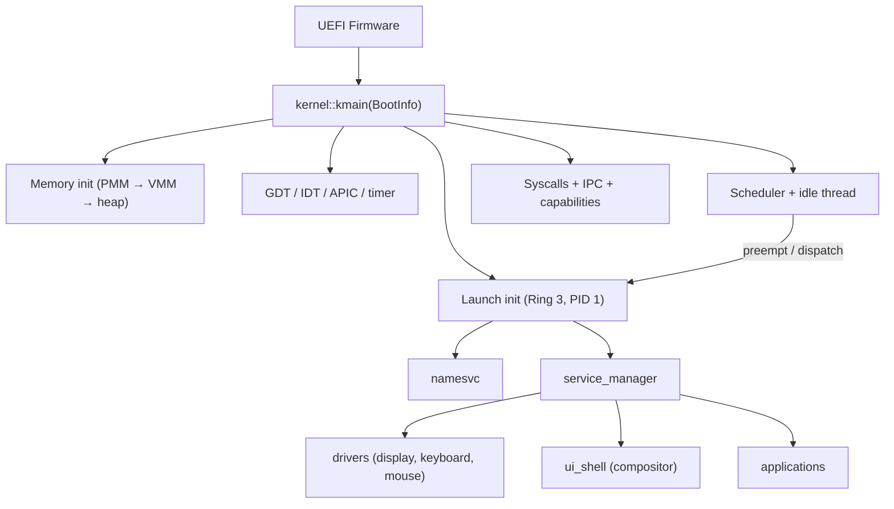
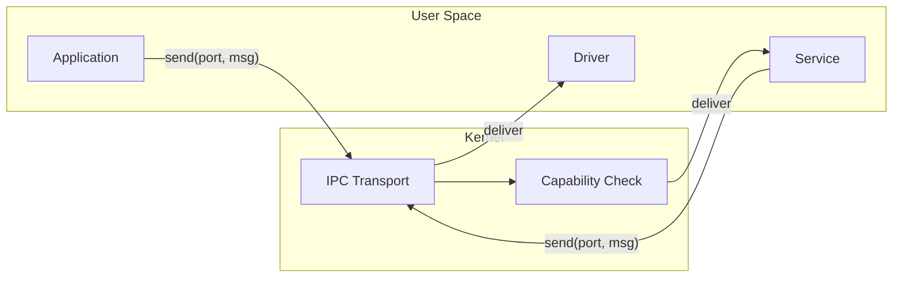

# Atom Operating System
[Ler em Português do Brasil](README-PTBR.md)


**Atom** is an experimental (mostly vibe-coded) **capability-based microkernel operating system** written in **Rust** and **x86-64 assembly**, with a complete user-space stack including a freestanding C library, software OpenGL rendering, a windowed desktop environment, and native application support.

> ⚠️ **Experimental software.** Expect breaking changes, missing features, and sharp edges. The project is primarily for learning, research, and incremental validation of OS design ideas.

---

## What Atom Is

Atom is a microkernel OS where the kernel provides the minimum trusted computing base — memory management, scheduling, IPC transport, and capability enforcement — while all policy-heavy components (drivers, filesystem, UI, applications) run in **user space** as isolated services communicating via **message passing**.

**Design principles:**

- **Capabilities-first security** — explicit authority, least privilege, delegation, and transitive revocation. Every kernel object is accessed through capability handles, not ambient authority.
- **Strong isolation** — separate address spaces with per-process page tables, higher-half kernel mapping, and validated memory operations.
- **IPC as the composition backbone** — ports and messages with support for zero-copy via shared memory regions, deadlock detection, priority inheritance, and batch operations.
- **Service-oriented user space** — init, service manager, and name service form a service bus that discovers and manages all system components at runtime.
- **SMP preemptive scheduling** — per-CPU run queues with priority-based round-robin, local timer preemption, cross-core wakeups, and reschedule IPIs.

---

## Current Status

**Latest reference build: alpha_5**

### Kernel

- UEFI boot on x86-64 via QEMU/OVMF
- Physical memory manager with two-phase bootstrap (static bitmap at boot, dynamic bitmap from RAM) supporting up to 16 GiB
- Virtual memory manager with 4-level paging, deep-copy page tables with verification pass, VMA tracking with guard pages, and demand paging infrastructure
- Kernel heap allocator (slab-based small allocations + page fallback)
- Interrupts via IDT + Local APIC with timer preemption and cross-core reschedule IPI
- SMP boot via ACPI MADT (BSP/AP discovery, AP startup trampoline, per-CPU online tracking)
- Context switching in x86-64 assembly with higher-half trampoline, stack canary validation, canonical address checks, and per-CPU syscall stack state (swapgs)
- Per-CPU scheduler (idle thread/current thread/run queue per CPU) with work stealing, remote wakeups, and affinity masks
- ~116 syscalls covering threads, IPC, capabilities, shared memory, filesystem, video modes, process spawning, and PCI/MMIO/DMA/IRQ device infrastructure
- IPC subsystem with ports, messages, deadlock cycle detection, priority inheritance, wait queues, and batch send/receive
- Capability system with handle-based access, permission bitflags, derivation, transitive revocation, and audit logging
- Shared memory manager with dynamic VA window allocation and owner-exit cleanup
- In-kernel drivers: AHCI (SATA), FAT32, Bochs Graphics Adapter (runtime resolution switching), PCI enumeration, and xHCI/USB-HID input
- FAT32 filesystem stack with read/write support through fsd-routed POSIX syscalls, with the active on-disk data path owned by the fsd userspace FAT32 driver over raw block I/O
- Process spawning from filesystem via `SYS_SPAWN_FROM_PATH`, loading **signed ATXF v3 executables** (Ed25519, verified against a kernel-side trust root before mapping) into isolated address spaces
- PCI/MMIO/DMA/IRQ syscall surface so user-space drivers (e.g. the e1000 NIC) can claim BARs, map device memory, allocate DMA buffers, and receive interrupts

### User Space

- **Services:** init (PID 1), namesvc (service discovery), service_manager (declarative boot), fsd (filesystem daemon), app_launcher (privileged process creation), nic_driver (e1000 NIC), netd (TCP/IP stack: ARP, IPv4, ICMP, UDP, TCP, DNS)
- **System applications:** display driver, keyboard driver, mouse driver, ui_shell (compositor + window manager), terminal emulator, display settings
- **Applications:** file manager (with double-click launching of .atxf executables), TinyGL gears demo, hello_c (C runtime demo), hello_atxf, filesystem test suite, browser, timesync (HTTP GET, demonstrates the full networking stack), and security_smoke (adversarial CI self-test harness)

### Runtime and Libraries

- **libc** — freestanding C standard library (string, stdlib, stdio, ctype, errno, assert, math via x87 FPU, unistd, time) with crt0.S runtime initialization, malloc/free via SYS_MMAP/SYS_MUNMAP, and full vsnprintf formatting
- **TinyGL** — software OpenGL 1.1 rendering (port of TinyGL 0.4.1) as a freestanding static library with a custom blit bridge converting RGB565 to compositor ARGB32 surfaces
- **libgui** — Rust library for window creation, drawing primitives (rounded rectangles, alpha blending, soft shadows), and event handling via IPC
- **atom_ui / atom_theme** — higher-level Rust widget and theming layers built on top of libgui
- **libimage** — Rust image decoders (PNG/GIF/JPEG) for application and desktop assets
- **libnet** — Rust networking client library (sockets, HTTP, ICMP, DNS helpers) for apps talking to `netd`
- **libipc** — Rust IPC wrapper for user-space services
- **libring** — lock-free ring buffer primitive shared across services
- **atom_abi** — shared crate defining syscall numbers, constants, and types as a single source of truth between kernel and user space

### Desktop Environment

- Compositor with shared-surface windowing, Z-order management, and graceful window shutdown (PendingClose state)
- Pill-shaped dock, circular window controls, centered window titles, active application indicator dots

For SMP internals (bootstrap, per-CPU structures, scheduler model, locking rules), see `docs/smp.md`.

---

## Architecture Overview

### Kernel vs User Space

```
┌──────────────────────────────────────────────────────────────┐
│                      User Space (Ring 3)                       │
│                                                                │
│  Services          System Apps          Applications          │
│  ├ init            ├ display driver     ├ file manager        │
│  ├ namesvc         ├ keyboard driver    ├ terminal*           │
│  ├ service_manager ├ mouse driver       ├ tinygl_demo         │
│  ├ fsd             ├ ui_shell           ├ browser             │
│  ├ app_launcher    │   (compositor)     ├ timesync            │
│  ├ nic_driver      └ display_settings   └ hello_c / hello_atxf│
│  └ netd                                                       │
│                          (* terminal runs as a system app)    │
│                                                                │
│  Libraries: libc, tinygl, libgui, atom_ui, atom_theme,        │
│             libimage, libnet, libipc, libring, atom_abi       │
├──────────────────────────────────────────────────────────────┤
│                 Syscall Interface (~116 calls)                 │
├──────────────────────────────────────────────────────────────┤
│                       Kernel (Ring 0)                          │
│                                                                │
│  PMM/VMM    Scheduler    IPC + SharedMem    Capabilities       │
│  Heap       Threads      Syscall dispatch   FAT32 / AHCI       │
│  Paging     Interrupts   Context switch     PCI / xHCI / BGA   │
└──────────────────────────────────────────────────────────────┘
```

### Boot Flow



### IPC and Service Composition

All user-space components communicate through kernel IPC ports. The service manager starts services declared in the boot configuration, and the name service allows runtime discovery. Capabilities control which services each process can access.



---

## Repository Layout

```text
atom/
├── kernel/
│   └── src/
│       ├── kernel.rs              # Kernel entry point and module wiring
│       ├── arch/                  # GDT and arch-specific glue
│       ├── mm/                    # PMM, VMM, heap, address spaces, OOM, VMA
│       ├── interrupts/            # IDT, APIC, handlers, context switch assembly
│       ├── drivers/              # In-kernel drivers (AHCI, FAT32, BGA, PCI, xHCI/USB-HID)
│       ├── syscall/              # Syscall dispatch (mod.rs) + capability policy table
│       ├── cap/ , cap.rs          # Capability system
│       ├── ipc.rs                 # IPC ports, messages, deadlock detection
│       ├── sched.rs , smp.rs      # Preemptive priority scheduler + SMP bringup
│       ├── thread.rs , process.rs # Thread and process primitives
│       ├── shared_mem.rs          # Shared memory regions
│       ├── executable.rs          # ATXF loading / image mapping
│       ├── system_manifest.rs     # Per-service capability manifest (trust root)
│       ├── *_selftests.rs         # Architectural & security boot self-tests
│       └── init_process.rs        # Launches init (PID 1) in isolated address space
├── shared/
│   ├── abi/                       # atom_abi: shared types/constants (kernel ↔ userspace)
│   └── atxf/                      # atom_atxf: ATXF v3 executable format + signed loader
├── userspace/
│   ├── libs/                      # libc, tinygl, libgui, atom_ui, atom_theme, libimage,
│   │                              #   libnet, libipc, libring, syscall wrappers
│   ├── system_apps/               # display, keyboard, mouse drivers; ui_shell; terminal;
│   │                              #   display_settings; demo_rects / demo_text
│   ├── services/                  # init, namesvc, service_manager, fsd, app_launcher,
│   │                              #   nic_driver, netd
│   └── apps/                      # fileman, tinygl_demo, hello_c, hello_atxf, fs_test,
│                                  #   browser, timesync, security_smoke
├── tools/
│   └── elf2atxf/                  # ELF → signed ATXF converter for user-space executables
├── keys/                          # ATXF signing keys / trust-root material
├── scripts/ci/                    # Security & build gates (see docs/security_pipeline.md)
├── linker/                        # Linker scripts for the UEFI target
├── build.sh / build.ps1           # Build, package, and run scripts
└── clean.sh / clean.ps1           # Cleanup scripts
```

---

## Building and Running

Atom runs under **QEMU** with **OVMF** (UEFI firmware). The build scripts handle toolchain setup, compilation of all workspace members, ATXF conversion, disk image packaging, and QEMU launch.

### Requirements

- Rust nightly (pinned by `rust-toolchain.toml`) with `rust-src` component
- QEMU x86-64
- OVMF firmware
- C cross-compiler (for libc and TinyGL builds)

### Build and Run

**Linux / macOS:**

```bash
./build.sh --clean --run           # single-core
./build.sh --run --smp=2           # dual-core SMP
./build.sh --run --smp=4           # quad-core SMP
```

**Windows (PowerShell):**

```powershell
.\build.ps1 --clean --run
.\build.ps1 --run --Smp 4
```

### Debugging

Serial output via QEMU console is the primary debugging channel. The kernel includes structured logging with per-subsystem tags. QEMU debugcon output can be routed to `debugcon.txt` depending on script configuration.

---

## Known Limitations

Atom is an experimental system in active development. Current known limitations include:

- **SMP is currently validated on QEMU x86-64** — production hardening for real hardware (broader APIC/ACPI variations) is still in progress
- **Networking requires QEMU `user` netdev** — the e1000 NIC driver and TCP/IP stack (`netd`) use QEMU's built-in user-mode networking (`-netdev user,id=net0 -device e1000,netdev=net0`). Both build scripts include these flags automatically when running with `--run`. Real hardware or other QEMU netdev backends are not yet supported.
- **Journal replay integration for userspace FAT32 is still maturing** — normal read/write path is userspace-owned in fsd, but crash-recovery replay coverage is still being expanded
- **Capability enforcement is partial** — the capability infrastructure (handles, permissions, derivation, revocation) is implemented, but not all syscalls enforce capability checks before execution
- **No ASLR or stack overflow detection** in user space
- **QEMU only** — not tested on real hardware

---

## Roadmap

See **`ROADMAP.md`** for the detailed phased plan. Near-term priorities include:

- Per-process file descriptor isolation
- Full capability enforcement across all syscalls
- User pointer validation in legacy syscalls
- Process abstraction (consolidating thread/address-space/resource ownership)
- SMP hardening for non-QEMU hardware paths and deeper scheduler telemetry

Longer-term goals include ARM64 support, deeper networking feature coverage, and expanded driver coverage.

---

## Contributing

Contributions are welcome, especially around:

- **Security hardening** — capability enforcement, user pointer validation, syscall sandboxing
- **Documentation** — IPC protocol, capability model, syscall reference, memory layout, ATXF format
- **Testing** — automated QEMU smoke tests, CI pipelines, syscall fuzzing
- **User-space evolution** — new services, drivers, and applications
- **Debugging and tracing tools**

See [`CONTRIBUTING.md`](CONTRIBUTING.md) and [`docs/security_pipeline.md`](docs/security_pipeline.md).

---

## Security pipeline

Atom OS ships a mandatory security pipeline (enforced in CI with **no**
`continue-on-error`). One documented way to run each thing:

```bash
make ci-build       # build every critical crate + bootable image
make ci-security    # fmt, clippy, syscall-policy gate, security-TODO gate,
                    # unsafe baseline, cargo audit, cargo deny, semgrep
make ci-qemu        # adversarial QEMU smoke (SMP 1/2/4); fails unless the
                    # serial log shows `SECURITY_SMOKE PASS all`
```

The pipeline fails the build on: a new syscall without an explicit policy
classification, an unjustified increase in `unsafe`, an untracked security
`TODO`, a supply-chain advisory/license/source violation, or any adversarial
QEMU scenario (PR1–PR5) not passing. Full reference and the security model are
in [`docs/security_pipeline.md`](docs/security_pipeline.md),
[`SECURITY.md`](SECURITY.md) and [`SECURITY_DEBT.md`](SECURITY_DEBT.md).

---

## License

See the `LICENSE` file for details.
